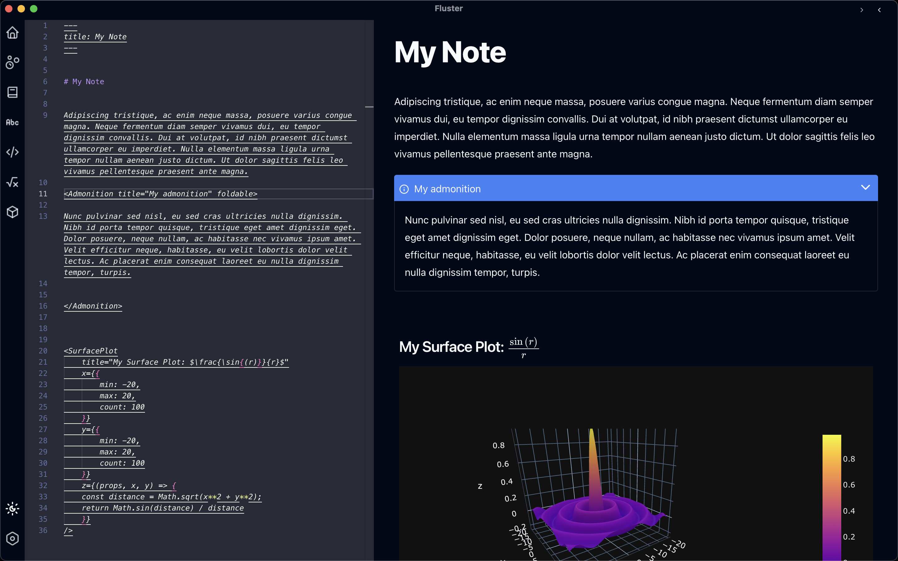

# Fluster

Free and open source academic note taking. Rust powered interactive plotting, dynamic RAG, and everything a modern researcher needs to be productive in one place... for free.

Checkout our website [here](https://flusterapp.com).

Or check out the current feature list [here](https://github.com/flusterIO)
